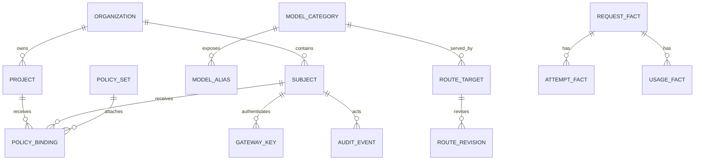

# Data Model And Storage

## Purpose

This contract describes the conceptual entity model and the starting storage posture. It does not freeze final schema names before implementation planning.

## Contract Metadata

| Field | Value |
| --- | --- |
| Scope | Conceptual entities, storage roles, retention tiers, migration posture |
| Owner | Data model and storage |
| Consumers | Policy, analytics, telemetry, control plane, deployment |
| Evidence | Entity model, PostgreSQL and Redis roles, escalation and retention rules |
| Open decisions | Concrete schema, extensions, retention durations, and HA topology remain open |

## Storage Principles

1. Keep durable configuration, audit, and analytics facts in PostgreSQL first.
2. Use Redis for low-latency ephemeral coordination such as counters, cacheable snapshots, or short-lived rate state.
3. Avoid a heavier analytics store until measured retention, query, or write pressure justifies it.
4. Keep request content out of the first-phase data model unless a retention decision explicitly adds it.
5. Preserve organization and future tenant scope on durable entities.

## Conceptual Entity Model

## Configuration Entities

| Entity | Key Fields |
| --- | --- |
| Organization | ID, label, state |
| Future tenant | ID, organization relation, state, boundary metadata |
| Subject | ID, type, state, roles, org/tenant scope |
| Gateway key | ID, hashed material, prefix metadata, subject, scopes, status |
| Project | ID, owner, state, org/tenant scope |
| Model category | ID, label, policy tags, lifecycle state |
| Model alias | ID, name, category, compatibility posture, lifecycle state |
| Route target | ID, kind, capabilities, secret reference, target metadata |
| Route revision | ID, route target, config payload reference, validation state |
| Policy set | ID, rule payload, validation state, revision |
| Policy binding | Subject/project/key/model/route attachment |
| IP allowlist | ID, CIDR entries, attachment scope, expiry |
| Rate policy | ID, windows, limits, attachment scope |

## Evidence Entities

| Entity | Grain | Owner |
| --- | --- | --- |
| Request fact | One logical gateway request | Capacity analytics |
| Attempt fact | One upstream attempt | Routing and analytics |
| Usage fact | Normalized token and usage record | Capacity analytics |
| Audit event | One privileged or security-significant action | Policy/security |
| Telemetry reference | Correlation metadata | Operational telemetry |

## PostgreSQL Roles

- Durable configuration and revisions.
- Subject/project/key metadata and policy bindings.
- Audit events.
- Request, attempt, usage facts and rollups.
- Operator queries and bounded reports.
- Migration history and schema constraints.

Useful PostgreSQL capabilities can include partitioning, materialized views, JSON where versioned payloads are justified, and extensions only when they remove real implementation cost.

## Redis Roles

- Rate-limit counters and token buckets.
- Short-lived concurrency state.
- Cacheable active route/policy snapshots where appropriate.
- Idempotency or nonce state if a control-plane command requires it.
- Short-lived operational hints that tolerate expiry.

Redis is not the durable audit ledger or the only copy of route policy.

## Index And Partition Direction

Likely high-value access paths:

- Time-window fact queries.
- Project, subject, model category, route target, and pool filters.
- Audit actor/resource/time queries.
- Active policy and route revision lookup.
- Key prefix/status lookup for authentication without exposing key material.

Fact tables may need time partitioning or rollup materialization when load proves it.

## Config Snapshot Direction

The data plane should read an active snapshot rather than assembling expensive joins for every token stream. Snapshot materialization should:

- Point back to durable revisions.
- Be invalidated or refreshed after activation.
- Fail closed if no usable active snapshot exists.
- Preserve enough revision identity for evidence and audit.

## Retention Tiers

| Data Class | Retention Direction |
| --- | --- |
| Config revisions | Keep for operational rollback and audit policy |
| Audit events | Keep per security/compliance posture |
| Request and attempt facts | Keep detailed grain for bounded operational window |
| Rollups | Keep longer for capacity trend analysis |
| Telemetry | Retain according to observability backend posture |
| Prompt/response bodies | Not first-phase durable storage |

Exact periods remain open operations decisions.

## Migration And Safety

- Schema migrations must be versioned and reversible where practical.
- Destructive retention jobs need observability and audit linkage when policy-sensitive.
- Sensitive columns need redaction-aware access patterns.
- Key material must be stored as verification-safe representation, not plaintext API keys.

## Non-goals

- Freeze table and index DDL before implementation planning.
- Make Redis the durable audit or policy authority.
- Retain prompt bodies merely to answer first-phase capacity questions.

## Escalation Triggers

Revisit storage posture when evidence shows:

- Fact ingestion or rollup jobs harm request-path performance.
- PostgreSQL storage/retention cost becomes unreasonable for required drilldowns.
- Analytics query concurrency or scan volume blocks operator use.
- Required near-real-time analytical joins cannot be satisfied with bounded rollups.

## Acceptance Checks

1. PostgreSQL and Redis roles are distinct and no audit authority depends only on Redis.
2. Organization and future tenant scope exist on durable security and usage entities.
3. The first fact model answers capacity questions without prompt-body storage.
4. Data-plane active config reads can be related back to durable revisions.
