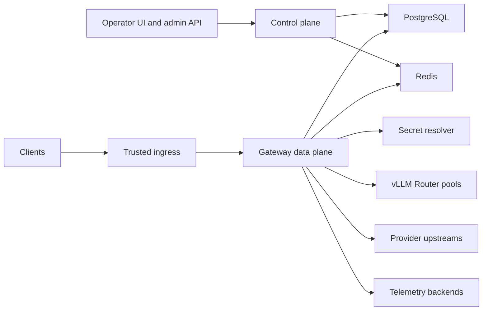

# Deployment, Operations, And Safety

## Purpose

This contract frames how the gateway should be deployed and operated without freezing one topology before implementation planning.

## Contract Metadata

| Field | Value |
| --- | --- |
| Scope | Deployment shapes, rollout, migration, recovery, safety, load readiness |
| Owner | Deployment, operations, and safety |
| Consumers | Architecture, policy, storage, telemetry, delivery planning |
| Evidence | Rollout steps, failure levers, backup posture, migration and load-readiness checks |
| Open decisions | Topology, HA, secret manager, ingress, and region posture remain open |

## Deployment Shape

## Environment Posture

| Environment | Purpose |
| --- | --- |
| Development | Local and integration iteration |
| Staging | Route, adapter, policy, migration, and load rehearsal |
| Production | Audited control plane and measured data plane |

Route target credentials, retention, and telemetry sinks must be environment-scoped.

## Operational Principles

1. Separate streaming-sensitive data-plane work from slower operator workflows.
2. Keep route and policy activation validated, revisioned, and observable.
3. Prefer stateless gateway replicas backed by durable config and controlled ephemeral coordination.
4. Treat upstream model pools as dependencies with health and drain semantics.
5. Practice backup, restore, and migration paths before enterprise commitments.

## Topology Decisions Left Open

- Single binary versus separate control-plane and data-plane services.
- Kubernetes, VM, or mixed deployment.
- PostgreSQL HA level and Redis topology.
- Secret manager integration.
- Ingress proxy, trusted IP extraction, and network policy.
- Multi-region posture.

Each remains an operations/TDR follow-up because current requirements describe shape and risk more than deployment estate.

## Rollout Safety

### Route Rollout

1. Draft route or pool config.
2. Validate protocol capabilities, secret references, health, and policy reachability.
3. Activate revision with audit.
4. Observe selected-route, failure, and capacity evidence.
5. Drain or roll back by revision when needed.

### Policy Rollout

1. Draft and validate rule syntax and attachment scopes.
2. Preview impacted aliases, routes, projects, and keys where feasible.
3. Activate with actor audit.
4. Observe denial, rate-limit, and fallback effects.

## Failure Operations

| Failure | Expected Operator Lever |
| --- | --- |
| vLLM Router pool unhealthy | Drain/disable route, inspect pool health, use eligible fallback |
| Provider timeout spike | Adjust route activation or fallback posture |
| Redis degraded | Apply defined rate-state degraded behavior, observe loss |
| PostgreSQL degraded | Preserve request correctness posture and control-plane guardrails |
| Secret resolution failure | Fail closed for affected upstream route |
| Adapter incompatibility | Disable or narrow route capability contract |
| Analytics lag | Surface gaps and protect data plane |

## Backup And Recovery

- PostgreSQL backup and restore is mandatory for durable config, audit, and fact history.
- Redis recovery posture depends on which ephemeral states are allowed to expire.
- Secret references and secret-manager recovery need a documented dependency path.
- Active config snapshots should be reconstructable from durable revisions.
- Restore drills should include policy, key metadata, route revisions, and audit queryability.

## Migrations

- Database migrations require staging validation and rollback posture.
- Adapter contract changes require compatibility matrix updates and route validation.
- Route config changes require revision evidence.
- Retention and redaction changes require policy/security review.

## Security Operations

- Trusted ingress chain defines client IP interpretation.
- Upstream credentials rotate without downstream leakage.
- Key issue and revoke events are audited.
- Operator role elevation is visible.
- UI and admin API are protected as control-plane surfaces, not public dashboards.

## Load And Performance Readiness

The first real load program should measure:

- About 400 concurrent human-use posture plus realistic service bursts.
- Streaming concurrency and cancellation.
- Policy and rate check overhead.
- Long-context vLLM Router path latency and selected-route distribution.
- Analytics/fact-write overhead and sink degradation behavior.

The benchmark harness belongs to implementation planning after route and protocol choices are concrete.

## Non-goals

- Select Kubernetes, VM, or multi-region topology before target environment review.
- Declare production SLOs before first-slice benchmarks exist.

## Acceptance Checks

1. Route and policy activation are revisioned, validated, and audited.
2. Backup and restore posture identifies PostgreSQL as durable authority.
3. Upstream dependency failure has an operator lever that respects policy eligibility.
4. Load-readiness questions include streaming, long-context, analytics writes, and dependency degradation.
