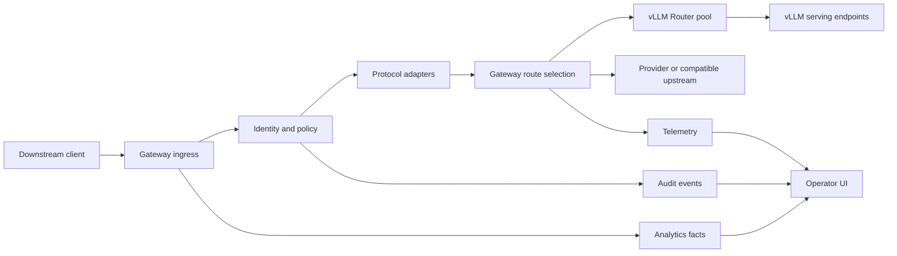

# System Architecture

## Purpose

Define runtime layers, trust boundaries, and responsibility invariants for the gateway blueprint.

## Contract Metadata

| Field | Value |
| --- | --- |
| Scope | Runtime architecture and boundary contract |
| Owner | System architecture |
| Consumers | Routing, policy, protocol, telemetry, deployment, delivery planning |
| Evidence | Component responsibilities, request states, trust boundaries, failure principles |
| Open decisions | Service topology, deployment estate, and secret-manager integration remain open |

## Architecture Intent

The architecture keeps serving-locality concerns close to the serving system while placing enterprise policy and business semantics in the gateway.

## Top-Level Diagram

## Architecture Invariants

1. Gateway policy determines eligibility before routing picks a target.
2. Fallback may choose a different eligible route but may not create eligibility.
3. vLLM Router selects same-model vLLM serving endpoints inside its pool.
4. Gateway selects above-pool route targets such as provider path, model category, and vLLM Router pool.
5. Protocol adapters cannot silently invent compatibility.
6. Analytics facts, telemetry, and audit events may share storage plumbing but remain separate evidence classes.

## Runtime Components

| Component | Responsibilities |
| --- | --- |
| Ingress | Authentication extraction, request envelope, streaming lifecycle, cancellation |
| Identity resolver | Gateway key, user/service, project, organization, future tenant context |
| Policy engine | Access, model eligibility, IP allowlist, limit decision, fallback constraints |
| Protocol adapter registry | Ingress validation, compatibility mapping, upstream mapping, response normalization |
| Route catalog | Aliases, categories, pools, provider targets, capabilities |
| Route selector | Eligible route choice, health-aware choice, configured fallback path |
| Upstream client layer | Provider clients and vLLM Router pool clients |
| Usage fact emitter | Request/token/latency/outcome attribution facts |
| Telemetry emitter | Metrics, logs, traces, health and dependency evidence |
| Audit emitter | Privileged change and security-significant event records |
| Operator control plane | Admin APIs and UI-backed commands |

## Trust Boundaries

| Boundary | Rule |
| --- | --- |
| Downstream client to gateway | Client sees only gateway credentials and gateway API |
| Gateway to upstream | Upstream credentials are secret references resolved inside trusted runtime |
| Control plane to data plane | Configuration changes are audited and versioned |
| Analytics to content | Metadata-first posture unless retention decision explicitly allows content sampling |
| Internal org to future tenant | Entity model preserves organization/tenant boundary even when one org exists |

## vLLM Serving Boundary

### Gateway Owns

- Which model alias/category the caller requested.
- Whether the caller is eligible.
- Which vLLM Router pool is eligible and selected.
- Policy, adapter, audit, analytics, and operator semantics.

### vLLM Router Owns

- Endpoint selection among same-model vLLM serving endpoints inside the router pool.
- Cache-aware or consistent-hash serving-locality behavior supported by the router layer.
- Router-local health and serving routing signals.

### Boundary Consequence

The gateway spec may expose pool-level policies and pool-level telemetry needs. It must not define a duplicate prefix-cache endpoint routing algorithm for vLLM endpoints.

## Request Flow States

| State | Owner | Failure Class |
| --- | --- | --- |
| Parse envelope | Ingress | Invalid request |
| Resolve identity | Identity resolver | Unauthenticated |
| Evaluate policy | Policy engine | Forbidden, limited, IP denied |
| Validate protocol | Adapter registry | Unsupported or degraded |
| Select route | Route selector | No eligible healthy target |
| Call upstream | Upstream client | Timeout, upstream error, cancellation |
| Normalize response | Adapter registry | Mapping or stream error |
| Emit evidence | Facts/telemetry/audit | Partial evidence with failure marker |

## Data Plane And Control Plane

### Data Plane

- High-frequency request path.
- Streaming-sensitive and backpressure-sensitive.
- Reads precompiled policy and route state.
- Emits asynchronous facts where loss policy allows.

### Control Plane

- Operator UI and admin APIs.
- Manages users/services/projects/keys/policies/routes/pools.
- Writes audit events for privileged changes.
- Publishes versioned route and policy snapshots to data-plane consumers.

## Configuration Model

- Configuration should have stable IDs and revision metadata.
- Route and policy rollouts should support validation before activation.
- Unsafe change classes should have explicit audit event types.
- The blueprint leaves rollout mechanism details to later implementation planning.

## Failure Principles

1. Fail closed for identity, upstream secret resolution, IP policy, and access eligibility.
2. Fail explicit for unsupported protocol features.
3. Fail observable for upstream health, queue, and latency issues.
4. Fail bounded for retries and fallback; no unbounded replay of long prompts.

## Non-goals

- Freeze a deployment topology before operations review.
- Replace route, policy, protocol, or data-model contracts with a single architecture diagram.
- Define endpoint-local prefix/cache algorithms inside the gateway.

## Acceptance Checks

1. Gateway and vLLM Router routing ownership is unambiguous.
2. Trust boundaries prevent downstream exposure of upstream credentials.
3. Request states identify owner and failure class before implementation planning.
