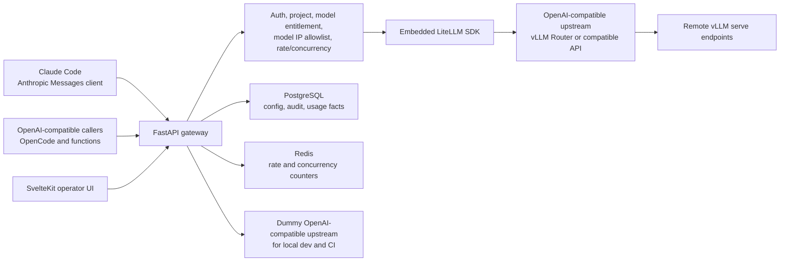

# Enterprise LLM Gateway MVP Design

## Purpose

This document cuts the broad enterprise LLM gateway blueprint into the first internal-production MVP. The MVP must serve real internal users, mainly Claude Code users, OpenCode-style agents, and direct OpenAI-compatible callers, while keeping the first implementation small enough to build and operate.

The design intentionally delegates protocol conversion to LiteLLM. The gateway owns enterprise control: authentication, model access, model-level IP allowlists, usage facts, route configuration, operator CRUD, and dashboarding.

## Current Decision Summary

| Area | MVP Decision |
| --- | --- |
| Product shape | Internal production core, not a demo |
| Primary users | Claude Code users first; OpenCode and direct OpenAI-compatible callers also supported |
| Backend | FastAPI / Starlette ASGI |
| Database | PostgreSQL |
| DB access | SQLModel async + Alembic; raw SQL or SQLAlchemy Core allowed for dashboard aggregates |
| Cache and counters | Async Redis |
| Operator UI | SvelteKit |
| Protocol adapter | Embedded LiteLLM Python SDK |
| LiteLLM version posture | Install and use latest LiteLLM; do not pin a fixed version |
| Upstream contract | OpenAI-compatible `/v1/chat/completions` API |
| vLLM serving | Remote vLLM services are started manually outside the gateway |
| vLLM Router | MVP generates router commands and stores config; it does not start or supervise router processes |
| Model routing | One model alias maps to one configured upstream/router pool |
| Model access | Gateway-managed users/services/projects/keys; no SSO |
| IP policy | Per-model allowlist or all-pass |
| Usage analytics | Basic pressure by time, user/service, project, model, request count, prompt tokens, completion tokens, total tokens, success/failure |
| Performance gate | No load-test gate for MVP; use deterministic unit/integration tests and real-upstream smoke tests |

## Goals

1. Provide one gateway URL and one gateway key surface for Claude Code, OpenCode-style agents, and OpenAI-compatible callers.
2. Let operators manage users, service accounts, projects, gateway keys, model aliases, model IP allowlists, and upstream route settings from a UI.
3. Route each model alias to one OpenAI-compatible upstream endpoint, usually a manually started vLLM Router.
4. Use LiteLLM as the only protocol conversion engine for Anthropic Messages, OpenAI chat completions, streaming, tool calls, reasoning fields, and provider-specific translation.
5. Record usage facts and request outcomes in PostgreSQL for basic operational pressure analysis.
6. Use Redis for low-latency rate and concurrency counters.
7. Keep all request-path database, Redis, and upstream HTTP operations async.
8. Support development without a real vLLM or OpenAI-compatible upstream through a dummy upstream server.

## Non-goals

- Do not implement Anthropic-to-OpenAI or OpenAI-to-Anthropic protocol conversion in gateway code.
- Do not use LiteLLM Proxy, LiteLLM virtual keys, LiteLLM budgets, LiteLLM users, LiteLLM teams, LiteLLM database schema, or LiteLLM admin UI.
- Do not manage remote `vLLM serve` processes.
- Do not start, stop, restart, supervise, tail logs, or auto-create uv environments for vLLM Router in MVP.
- Do not support SSO or enterprise IdP integration.
- Do not implement fallback, weighted routing, canary routing, or multiple pools per alias.
- Do not implement gateway-side prefix-cache routing.
- Do not require load testing before MVP development proceeds.
- Do not estimate missing token usage with a gateway tokenizer.
- Do not store prompt or response bodies for the first usage dashboard.

## Architecture



The FastAPI service is a monolith for MVP. UI, admin APIs, auth/policy, request proxying, LiteLLM invocation, usage collection, and dashboard queries live in one deployable service. Internal modules still keep clear boundaries so that process management or control/data-plane separation can be added later.

## Request Surfaces

### Anthropic Messages Ingress

The MVP exposes the Anthropic Messages-compatible route shape needed by Claude Code. The gateway validates its own auth and policy before passing the request to LiteLLM.

Expected route family:

- `POST /v1/messages`
- streaming and non-streaming
- text content
- tool definitions and tool-use/tool-result turns as supported by LiteLLM and the configured upstream
- reasoning or provider-specific parameters only as passed through and interpreted by LiteLLM

The gateway does not inspect or rewrite Anthropic content blocks except where needed for auth, model alias extraction, request ID correlation, and safe logging redaction.

### OpenAI Chat Completions Ingress

The MVP exposes OpenAI-compatible chat completions for OpenCode-style agents and direct callers.

Expected route family:

- `POST /v1/chat/completions`
- streaming and non-streaming
- text messages
- OpenAI `tools`, `tool_choice`, and `tool_calls` as supported by LiteLLM and upstream

The same gateway model alias can be used from Anthropic Messages and OpenAI chat completions clients.

## LiteLLM Boundary

LiteLLM is embedded as a Python SDK dependency inside the FastAPI process.

### LiteLLM Owns

- Protocol conversion.
- Provider request construction.
- Streaming event conversion.
- Tool-call request and response conversion.
- Reasoning-field conversion or forwarding.
- Calling the configured OpenAI-compatible upstream.
- Returning response objects, stream chunks, error objects, and usage data when available.

### Gateway Owns

- Gateway API key authentication.
- Subject, service account, and project resolution.
- Model alias lookup.
- Model entitlement.
- Per-model IP allowlist or all-pass enforcement.
- Rate and concurrency checks.
- Usage fact persistence.
- Audit event persistence.
- Route and upstream configuration.
- Operator UI and admin API.

### Explicit Rule

If LiteLLM does not support a conversion or behavior, the gateway records the failure as an adapter dependency limitation. The gateway must not add local conversion patches in MVP. Resolution options are LiteLLM upgrade, LiteLLM configuration change, upstream model/server configuration change, or explicit feature deferral.

### Version Posture

The MVP installs latest LiteLLM rather than pinning a fixed version. The running gateway must still record the imported LiteLLM version at startup and expose it in an operator diagnostics endpoint so failures can be reproduced.

## Upstream And Router Model

### OpenAI-Compatible Upstream

The gateway ultimately calls one OpenAI-compatible `/v1/chat/completions` upstream per model alias. That upstream can be:

- a manually started vLLM Router,
- a direct vLLM OpenAI-compatible server,
- or a real external OpenAI-compatible API supplied for development or staging.

The gateway only requires:

- base URL,
- model name as expected by upstream,
- API key or no-auth setting,
- streaming support flag,
- tools support flag,
- optional notes about reasoning/tool parser configuration.

### Router Command Generator

MVP includes router command generation, not router process management.

For each model alias, operators can configure remote vLLM endpoints and router settings. The gateway stores the configuration and generates a copyable command such as:

```bash
vllm-router \
  --worker-urls http://gpu-a:8000 http://gpu-b:8000 \
  --policy consistent_hash \
  --host 0.0.0.0 \
  --port 18001
```

The exact command flags must follow the installed vLLM Router version and selected router mode. The command generator should be implemented as a versioned template, not as free-form string concatenation scattered through UI code.

### Router Policy

MVP supports operator selection between:

- `consistent_hash`
- `cache_aware`

Default: `consistent_hash`.

Reason: `consistent_hash` is predictable and supports session-locality style reuse. `cache_aware` is exposed as an advanced option because it may perform better for repeated prefixes when the router and upstream expose the needed behavior, but MVP does not require proving that through load tests.

### Router Runtime Management Deferred

The following are post-MVP:

- auto-create uv environment for vLLM Router,
- install router from the gateway,
- start/stop/restart router processes,
- PID tracking,
- log tailing,
- auto port allocation,
- restart recovery,
- systemd or container integration.

## Auth And Policy

### Identity

MVP uses gateway-managed identities only.

Entities:

- human user,
- service account,
- project,
- gateway key,
- model alias.

No SSO. No external IdP.

### Request Evaluation Order

1. Parse request and determine endpoint family.
2. Extract trusted client IP from configured source.
3. Authenticate gateway key.
4. Resolve subject or service account.
5. Resolve project attribution.
6. Resolve requested model alias.
7. Check subject/key/project status.
8. Check key entitlement for the requested model alias.
9. Check the requested model alias IP policy.
10. Check Redis-backed rate and concurrency limits.
11. Call LiteLLM with the resolved upstream config.
12. Persist usage and request facts.

If the model IP allowlist denies the request, the gateway must not construct an upstream request.

### Model IP Allowlist

Each model alias has one IP policy:

- `all_pass`, or
- a list of CIDR ranges.

Policy is evaluated per requested model. A key may access multiple models; an IP denied for one model does not imply denial for another model unless that model has the same allowlist.

### Gateway Keys

Gateway keys belong to users or service accounts. Key material is stored only as a verification-safe hash plus prefix metadata. Plaintext key value is shown only once at creation.

## Rate And Concurrency

MVP includes a baseline rate/concurrency layer but keeps it simple:

- requests per time window,
- active streaming requests per key or subject,
- optional project-level request window.

Redis is the source for live counters. PostgreSQL stores durable policy configuration and request facts. Redis counter failure should fail closed or degraded according to an explicit environment setting; production-like environments should fail closed for auth and policy-critical counters.

## Usage Facts And Dashboard

### Usage Source

Token usage source priority:

1. LiteLLM response usage.
2. Missing usage marker.

The gateway does not estimate token counts in MVP. If usage is absent, the dashboard must show that the source is missing rather than displaying invented zeros as real usage.

### Request Fact

Minimum fields:

- request ID,
- timestamp start and end,
- endpoint family,
- subject ID,
- subject type,
- project ID,
- model alias,
- upstream target ID,
- streaming flag,
- outcome family: success, auth failure, policy denial, rate limited, adapter failure, upstream failure, client cancelled,
- usage source,
- prompt tokens when available,
- completion tokens when available,
- total tokens when available.

### Dashboard Questions

MVP dashboard must answer:

- requests by selected time window,
- prompt, completion, and total tokens by time window,
- success/failure by time window,
- usage by user or service account,
- usage by project,
- usage by model alias.

No capacity recommendation, cache efficiency score, latency analysis, concurrency analysis, or retry/fallback overhead is required for MVP.

## Operator UI

SvelteKit provides the operator UI. The UI should be dense, operational, and CRUD-first.

### Required Views

| View | MVP Capability |
| --- | --- |
| Overview | Basic request and token pressure summary |
| Users and services | Create, disable, view keys and project bindings |
| Projects | Create, update, assign subjects/services |
| Gateway keys | Issue, revoke, show prefix/status, copy value once on creation |
| Model aliases | Create/update alias, upstream model name, capability flags, IP policy |
| Upstream pools | Configure base URL, API key mode, health path, associated alias |
| Router command generator | Configure worker URLs, policy, port, and copy generated command |
| Usage dashboard | Filter by time, user/service, project, model, outcome |

### Deferred UI

- Full audit explorer.
- Route diff/rollback UX.
- Log tailing.
- Router process status beyond configured upstream health.
- Multi-tenant external customer UI.

## Admin API

The UI and any automation use the same FastAPI admin API.

Minimum resource families:

- `/admin/users`
- `/admin/service-accounts`
- `/admin/projects`
- `/admin/gateway-keys`
- `/admin/model-aliases`
- `/admin/upstreams`
- `/admin/router-command`
- `/admin/usage`
- `/admin/health`
- `/admin/diagnostics`

Mutations must emit audit events, even if the audit UI is deferred.

## Data Model

### Configuration Tables

Minimum durable tables:

- `subjects`
- `projects`
- `project_memberships`
- `gateway_keys`
- `model_aliases`
- `model_entitlements`
- `model_ip_policies`
- `upstream_targets`
- `router_command_configs`
- `rate_policies`
- `audit_events`

### Fact Tables

Minimum durable fact tables:

- `request_facts`
- `usage_facts`

For MVP, request and usage can be one table if the schema still distinguishes request outcome from token facts and usage source.

### Async Access

All request-path database access must use async SQLModel/SQLAlchemy sessions. Dashboard aggregate queries can use SQLAlchemy Core or raw SQL through the same async engine.

## Local Development And Testing

### Dummy Upstream

The repo should include a dummy OpenAI-compatible upstream server for local development and CI.

Required dummy features:

- `POST /v1/chat/completions`,
- non-streaming fixed text response,
- streaming fixed chunk response,
- fixed OpenAI-style `tool_calls` when tools are provided,
- fixed usage object,
- configurable missing usage response,
- configurable upstream error response,
- configurable latency.

The dummy server is not a protocol authority. It exists to test gateway policy, LiteLLM invocation boundary, streaming plumbing, usage persistence, and UI/API flows without a real external endpoint.

### Real Upstream Smoke Mode

The gateway must support a developer-provided real OpenAI-compatible upstream:

- base URL,
- model name,
- API key.

This is used for manual and staging smoke tests with Claude Code, OpenCode, and direct OpenAI-compatible calls. It is not required for CI.

## Verification Strategy

### Unit Tests

- API key authentication.
- Model alias lookup.
- Model entitlement.
- Model-level IP allowlist.
- Rate/concurrency decision with Redis test fixture or fake.
- Router command generation.
- Usage fact normalization from LiteLLM response shape.
- Missing usage marker.
- Audit event emission for CRUD mutations.

### Integration Tests

- OpenAI chat non-streaming request through gateway to dummy upstream.
- OpenAI chat streaming request through gateway to dummy upstream.
- Anthropic Messages request through gateway to LiteLLM and dummy/compatible upstream where feasible.
- Tool-call request through gateway with dummy upstream response.
- Policy-denied request does not call upstream.
- IP-denied model request does not call upstream.
- Usage fact appears after success.
- Failure fact appears after upstream error.

### Real-Upstream Smoke Tests

Run manually after the user supplies endpoint, model, and key:

- Claude Code basic prompt.
- Claude Code tool-call flow.
- OpenAI chat non-streaming call.
- OpenAI chat streaming call.
- Usage appears in dashboard when LiteLLM returns usage.

### No Load-Test Gate

MVP implementation does not wait on load testing. Later production hardening can add load and soak tests after a real upstream environment exists.

## Acceptance Criteria

1. An operator can create a project, subject or service account, gateway key, model alias, model IP policy, upstream target, and router command config from the UI.
2. A valid gateway key can call the same model alias through Anthropic Messages and OpenAI chat completions.
3. Streaming and non-streaming requests both work through the gateway.
4. Tool-call traffic is delegated to LiteLLM and upstream; gateway does not implement protocol conversion.
5. A model-level IP denial prevents any upstream call.
6. A subject/key without model entitlement receives a policy denial before LiteLLM is called.
7. Basic usage facts are visible by time, user/service, project, model, and success/failure.
8. Missing LiteLLM usage is recorded as missing, not estimated.
9. Router command generation produces a reviewable command from stored config.
10. Dummy upstream tests can run without a real OpenAI-compatible API.
11. Real-upstream smoke tests can be configured with endpoint, model name, and key.

## Open Items Before Implementation Planning

The implementation plan should close these without changing the MVP scope:

1. Exact Python package set for FastAPI, SQLModel async, Redis, LiteLLM, and SvelteKit build integration.
2. Exact trusted client IP extraction configuration for local and deployed environments.
3. Exact database schema names and Alembic migration order.
4. Exact LiteLLM SDK call signatures for Anthropic Messages and OpenAI chat completions against an OpenAI-compatible upstream.
5. Exact dummy upstream response fixtures.
6. First real upstream endpoint, model name, and API key for smoke testing.

## References

- Broad blueprint: `../../specs/enterprise-llm-gateway/README.md`
- Phased delivery: `../../specs/enterprise-llm-gateway/phased-delivery.md`
- Routing and vLLM boundary: `../../specs/enterprise-llm-gateway/routing-and-serving-pools.md`
- Policy and audit: `../../specs/enterprise-llm-gateway/policy-security-and-audit.md`
- Protocol compatibility: `../../specs/enterprise-llm-gateway/protocol-compatibility.md`
- Data model and storage: `../../specs/enterprise-llm-gateway/data-model-and-storage.md`
- Operator UI and admin APIs: `../../specs/enterprise-llm-gateway/operator-ui-and-admin-apis.md`
- vLLM Router repository: <https://github.com/vllm-project/router>
- vLLM Router production-stack CLI reference: <https://docs.vllm.ai/projects/production-stack/en/vllm-stack-0.1.6/user_manual/router/cmd.html>
- LiteLLM documentation: <https://docs.litellm.ai/>
- Claude Code LLM gateway documentation: <https://code.claude.com/docs/en/llm-gateway>
